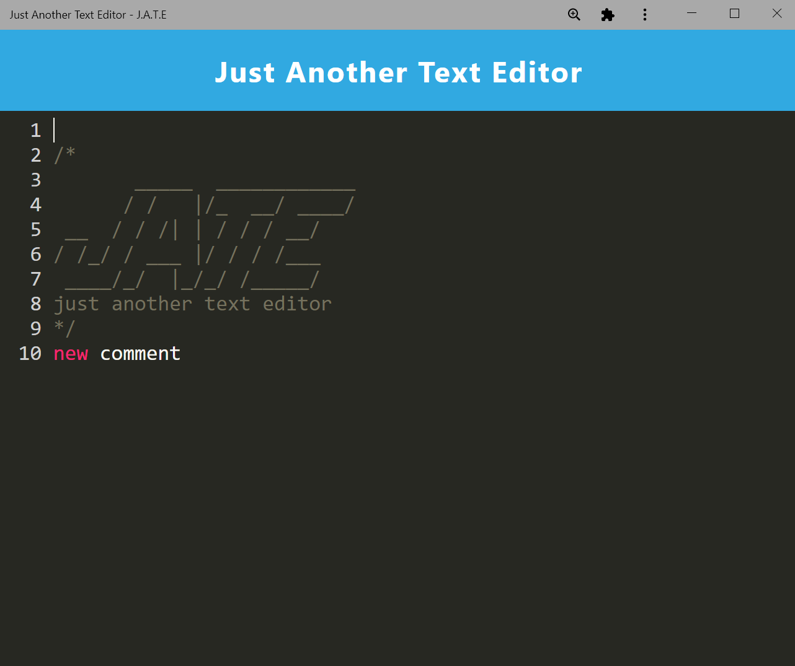

# DU-HW19-PWA-Text-Editor

DU Coding Bootcamp Homework 18: NoSQL: Social Network API

# node.js application with SQL (MongoDB) connectivity
This is a node.js script using **express** relying on NPM package **mongoose** to access a MongoDB server as defined by the connection in the /config/connection.js and environment variables (.env) using **dotenv**.

Github Repository Address: 

## Live App
>**Heroku**: This site is currently live on Heroku.
See live deployed app at <https://dry-beach-18349.herokuapp.com/>

## GitHub
See GitHub Repo at <https://github.com/GittinIt6/DU-HW19-PWA-Text-Editor>

## Purpose

This application is specific to anyone that wants to create notes or code snippets with or without an internet connection.

## Instructions for GitHub developer use
1. Ensure you have downloaded and installed node.js and have rebooted your system (if Windows)
2. Clone repository to your system.
3. From a terminal, ensure you are in the root package.json directory
4. Run:
~~~
npm i
npm run install
npm start
~~~

## Audience

The intended audience is an individual that wants to create notes or code snippets with or without an internet connection.

&#x2611; **Developer** Technical Knowledge:
A developer editing this code does need to have a technical background, and *should* understand node.js, express, and MYSQL capabilities.

## Technical Detail

This application uses node.js with **babel**, **idb**, and **code-mirror**.

The files are configured as follows:
```
Root Directory/
|
│ --package.json
│ --.gitignore
│ --readme.md
│ --.npmrc
|
└───client/ (folder)
|  |
|  └──dist (folder)
|     └──assets (folder)
|  |
|  └──src (folder)
|     |
|     └──css (folder)
|     └──images (folder)
|     └──js (folder)
|
└───server/ (folder)
   |
   └──routes (folder)

```
>**node.js**: This site uses node.js <https://nodejs.org/>

>**babel**: This site uses babel <https://babeljs.io/>

>**idb**: This site uses idb <https://www.npmjs.com/package/idb>

>**code-mirror**: This site uses code-mirror <https://codemirror.net/>

### Screenshot:



## Revision History 

1. This application was created in May 2022 as part of a bootcamp assignment. It was created using starter code provided by the instructor.